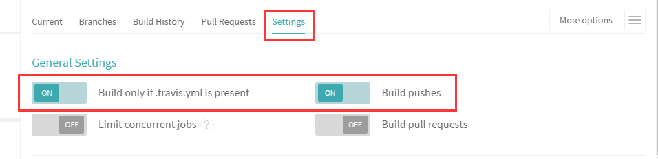

额，本篇文章是[这篇博文](/post/hexo-build-static-blog-process/)的后续，当时本来打算写完上篇就挨着写的，结果嘛。。。跳票了一个多月~~今天还是捡回来重新把他写完。

上次讲了第一步是用 Hexo 生成静态博客，第二步是部署到 GiHub Pages；但是有觉得部署 GitHub Pages 比较简单，感觉过程能讲地方的不是很多，于是这次再加一点内容，加上 Travis-CI 做持续集成。

嘛，第一步还是照惯例先来说说第一个 GitHub Pages 吧~

呃，至于没有 GayHub 账号的人，多半也没有兴趣点开这篇文章吧。。。

~~（想多了吧！即使有账号也没人有兴趣点开这篇文章看。。。）~~

---

## GitHub Pages

GitHub 提供 [GitHub Pages](https://pages.github.com/) **静态站点托管服务**，旨在方便用户可以通过静态页面直接展示他们的项目主页和各种演示。

**简单的概括，GitHub Pages 服务就是把项目仓库中 `gh-pages` 分支的内容作为静态页面的文件，并提供 `https://<username>.github.io/<repository>/` 的域名以供访问。 其中 `<username>` 是指用户名，`<repository>` 是指仓库名。**

其中有个例外，就是当仓库名为 `<username>.github.io` 时，是固定解析的 `master` 分支，其他仓库是默认解析 `gh-pages` 分支并且可以配置使用哪个分支作为页面；`<username>.github.io` 仓库就只能解析 `master` 分支中的文件，并且访问域名就是 `https://<username>.github.io/`，称为个人页面，其他仓库的访问需要加上 `/<repository>/` 目录，被称为项目页面。

举个例子，GitHub 用户 `zthxxx` 有个仓库 `HelloWorld`，并且仓库中也有 `gh-pages` 分支，放了一个 `index.html` 里面写的 `<h1>Hello World</h1>`，那么我们就可以通过 `https://zthxxx.github.io/HelloWorld/` 来访问这个页面，然后看到一个大大的 Hello World。

一般项目页面是具体要展示某个仓库的项目的时候使用，我们今天讲的个人博客就类似于一个个人主页，所以就使用 GitHub Pages 的个人页面好了。

操作过程也十分简单，具体步骤大概就是：

1. 先建一个 `<username>.github.io` 的仓库；
2. 然后将我们上次讲到的 Hexo 生成的博客静态页面文件填到仓库 `master` 分支；
3. 最后通过 `https://<username>.github.io/` 访问就是了；

一切都很简单，就跟我们平时新建仓库、push 文件、打开浏览器的操作没什么两样，于是我也没什么兴趣再去截几张操作步骤的图来放在这里，实在不知道怎么操作的，可以看 [这里](https://xuanwo.org/2015/03/26/hexo-intor/#section-2) 或者 [这里](https://zhuanlan.zhihu.com/p/22191919) 讲的步骤。

如果你的 Hexo 博客照 [我上次所讲的配置](http://blog.zthxxx.me/post/hexo-build-static-blog-process/#部署-配置部分) 一样配好了的话，使用 `hexo deploy` 命令，Hexo 会通过 Git 自动部署到配置的指定仓库分支了，Hexo 博客源码本身我们一般就手动 push 放到另一个分支中，比如 `blog-source` `writing` `dev` 之类的，表示用来写作的都行。

**好了，下面讲的所有步骤都只是为了能不用敲 `hexo deploy` 命令这一个目的，不用看了。**

~~（诶，别，别啊，我开玩笑的，别真关页面啊！）~~

---

## Travis-CI

现在要讲的是用于**持续集成构建**的工具，Travis-CI。

Travis-CI 能够通过 [GitHub Webhook](https://developer.github.com/webhooks/) 将推送的代码自动获取到虚拟环境，并根据项目根目录 `.traivs.yml` 文件中的描述的环境和命令来执行一系列构建任务。

这个持续集成原本作用是，持续自动的将推送到 GitHub 仓库中的代码，经过构建和运行测试后，把代码合并到主干并部署发布到指定的生产环境。

当然，我们这里并没有用到持续集成——代码都是自己手动推送合并的，也没法测试，顶多算是使用到了其中的自动部署功能。

我们现在的唯一目的就是~~为了不用敲 hexo deploy 命令~~为了让我们写好的博客内容能够被自动构建并发布到 GitHub Pages 页面。

Travis-CI 分收费版和[免费版](https://travis-ci.org/)，免费版有一些限制比如构建时间有限和不能构建私有仓库之类的，不过这里无关紧要，所以我们就用[免费版](https://travis-ci.org/)。

打开 [Travis-CI 官网](https://travis-ci.org/)，使用 GitHub 账号就可以登陆。


登录后左边会显示设置了构建的仓库，右边显示正在构建的项目。初次使用 Travis-CI 的话，这两块应该都是空的。


现在我们需要添加一个仓库到构建中，先点击左边仓库标题 `My Repositories` 旁边的加号，进入仓库选择界面。


点击右上方的 `Sync account` 按钮可以手动同步一下所有仓库状态到 Travis-CI 中。下面的每个仓库名前面有个打勾打叉的滑动开关，打开开关表示把对应的项目添加到 Travis-CI 的构建列表中开启构建。


开启构建之后就可以通过左侧的项目栏选择具体的项目查看了。Travis-CI 是通过 push 来触发构建的，所以在构建我们的博客之前，先在 Travis-CI 中对博客所在的项目进行一些设置。在查看项目界面，点击右侧 `More options` -> `Settings` 选项中，开启 `Build only if .travis.yml is present` 以及 `Build pushes` 选项；这表示只有 `.travis.yml` 文件存在的 push 推送才会被构建。




在 Travis-CI 开始构建时，还需要获取一些信息，比如需要怎么的环境、通过什么过程来构建等等，于是， Travis-CI 允许用户在项目根目录放置 `.travis.yml` 文件，通过 YAML 语言来描述环境以及构建过程等。

对于 `.travis.yml` 文件的使用，应该先查看[官方文档](https://docs.travis-ci.com/user/getting-started)，里面包含了多种语言的开始教程。简单的说就是要告诉 Travis-CI 你需要什么系统环境、需要什么库、要怎么初始化环境、执行什么构建脚本、构建成功要做什么等等这些。

我直接把我博客的 [`.tarvis.yml`](https://github.com/zthxxx/zthxxx.github.io/blob/writing/.travis.yml) 文件贴上来，都加了详细注释的，基本上简单的构建都可以参照这个写法。

```yaml
# .tarvis.yml
language: node_js # 指定语言环境
node_js:
  - "6" # 指定 NodeJS 版本
dist: trusty # 指定系统版本。trusty 是指 Ubuntu 14.04 发行版的名称
sudo: required # 是否需要 sudo 权限

branches: # 指定要构建的分支
  only: # only 表示只构建以下分支
  - writing

install: # 在安装项目环境阶段需要运行的命令，一条一行，类似的还有 before_install
  - source travis_env_init.sh # 执行指定的 shell 脚本来做初始化

script: # 在构建阶段需要运行的命令，一条一行，类似的还有 before_script、after_script
  - hexo clean
  - hexo generate # Hexo 常规命令，执行清理和生成

after_success: # 在构建成功后要运行的命令，构建失败不会执行，其他同上
  - hexo deploy > /dev/null # 通过 hexo 的 deploy 命令部署博客

notifications: # 设置通知项
  email: true
```

在上面的 `install` 项中，有一条 `source travis_env_init.sh`，是由于我个人习惯，如果初始化命令比较多比较复杂，我一般就不直接写在 `.travis.yml` 文件中，而是单独建一个初始化环境的 shell 脚本，在 `.travis.yml` 中只是执行它，有兴趣的可以参考我博客的 [`travis_env_init.sh`](https://github.com/zthxxx/zthxxx.github.io/blob/writing/travis_env_init.sh) 脚本。

其实这里我们用到的初始化环境的命令也相对简单，我这里也贴一下嘛：

```bash
# travis_env_init.sh
# 全局安装 Hexo
npm install -g hexo
# 全局安装 Hexo 命令行工具，因为我们是命令行操作
npm install -g hexo-cli
# 安装 package.json 中的依赖
npm install
```

好了，现在往仓库中 push 一个 commit，Travis-CI 就会自动获取代码并构建了。

那么，现在又有一个问题了——我们的目的是自动部署到 GitHub Pages，用的是 `hexo deploy` 命令，但是 Hexo 又配置使用的是 Git push 来推送的，那么 Travis-CI 怎么有权限操作我的 GitHub 仓库呢！

---

## GitHub Access Token

首先我们肯定不应该把自己的 ssh 私钥作为文件放到仓库。

那么现在有两种解决办法。

第一种是加密私钥文件上传到 Travis 的空间，但是这种办法相当麻烦，要下载本地工具、重新生成密钥、加密上传、在 GitHub 添加私钥、还要在脚本中增加解码的命令等等，总之非常麻烦，因此这里我不推介使用这种办法，想具体了解这种方法的，可以看这两篇博文：[静态博客遭遇持续部署](https://blog.jamespan.me/2015/11/01/ci-your-hexo-blog)  [使用 Travis CI 自动部署 Hexo](https://www.v2ex.com/t/170462)

现在要讲的就是更推荐的另一种方案，使用 GitHub Access Token。

GitHub 允许你通过 [设置页面](https://github.com/settings/tokens) 添加一个个人访问令牌（Personal access tokens），使用 Assess Token 将有权限通过 https 访问 GitHub Api 操作自己的仓库。这个就是我们需要的。

现在我们来添加一个 token，先进入自己 GitHub 的 [设置页面](https://github.com/settings/tokens)，点击 `Personal access tokens` -> `Generate new token` 按钮，新建一个 token。


在权限设置中，我们只需要操作仓库，因此只需要打开仓库相关的权限就够了，权限开放应该满足最小原则，能少就少。设置好权限后点击生成按钮就会生成完毕并跳到 tokens 列表。


现在就需要把刚生成的 Access Token 的值复制下来，**注意，这个页面一旦刷新过了， token 就不能再显示了，没记住的只能重新生成一个了。**


嗯，现在 Access Token 也有了，能操作仓库了，那么，这个 token 应该放到哪里呢？

肯定不是放到代码里。。。

其实在 Travis-CI 的项目设置界面就有提供设置环境变量，我们就应该把 token 放到那里。

回到我们 Travis-CI 的 [博客项目设置页面](https://travis-ci.org/zthxxx/zthxxx.github.io/settings) 中，添加一个名为 `GIT_REPO_TOKEN` 的环境变量储存我们的 token，并记得要设置 ` Display value in build log` 为 OFF，关闭变量的显示，否则等于公开了 token。


现在在我们的执行脚本中就能使用 `$GIT_REPO_TOKEN` 访问 token 的环境变量了~

然后就是如何使用了。在 Hexo 部署前，我们应该把原来的部署仓库地址用带有 Access Token 的地址替换掉，于是在 `.travis.yml` 的 `hexo deploy` 命令前增加一条命令，或者是在之前提到的 `travis_env_init.sh` 初始化脚本中增加这条命令：

```bash
sed -i'' "s~git@github.com:~https://${GIT_REPO_TOKEN}@github.com/~" _config.yml
```

这样，在执行时，这条命令就能自动替换到有权限操作的 token 地址了，并且也不会泄露或者影响本地的原始配置文件。我一般习惯把这种初始化相关的命令都放到 `travis_env_init.sh` 文件中。

---

## 最后的效果

加了自动部署后，我们现在写完一篇博文后，就跟平时使用 Git 控制版本和推送一样，只需要

```bash
git add --all
git commit
git push origin writing
```

push 之后，Travis-CI 就能自动帮我们构建博客并部署到 GitHub Pages 了，本地的操作就只是单纯的写作，跟 Hexo 本身完全不再发生关系，一切就跟我们平时写文章一样~

于是又可以愉快的玩耍啦~ （￣▽￣）


