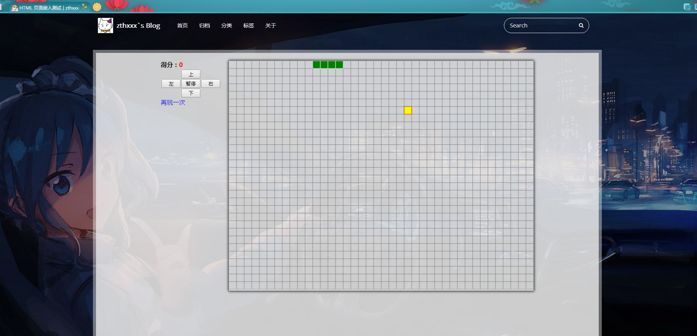

最近有个需求，想要挂载一个已有的页面到 hexo 博客，比如打开一篇博客，里面是显示的挂的淘宝的主页。

主要是最近要做一些 H5 页面，想找个空间挂载，又暂时不想另外找云服务器做后台，于是就想在我这个已有的博客嵌入这些 H5 页面来显示，每个页面通过一篇博文作载体，博文就是一个 iframe，用来显示每个 H5 页面。

于是做了一个 embed 的 layout 专门作为嵌入页面的布局，现已添加到我自己修改的 [**icarus**](https://github.com/zthxxx/hexo-theme-icarus) 主题中。

### 使用方法

配置主题为我修改的 icarus 后，embed 布局已经在主题里了。

使用 embed layout 前先确保已在主站配置文件中打开资源文件夹选项：

```yaml
# /_config.yml
post_asset_folder: true
```

然后在主站配置文件中添加一些后面需要用到的忽略参数，用来忽略对所有要嵌入页面的渲染：

```yaml
# /_config.yml
skip_render:
  - '_posts/*/embed_page/**'
```

在博客更目录下的 `scaffolds/` 目录下，新建一个模板文件 `embed.md`：

```yaml
# /scaffolds/embed.md
---
title: {{ title }}
date: {{ date }}
layout: embed
description:
iframe_url:
---
```

准备好要嵌入的页面，然后新建一篇博文，注意使用 embed 的模板：

```bash
hexo new embed "HTML 页面嵌入测试"
```

建立博文后，会在 `/source/_posts` 文件夹中多一个 md 文件 `HTML-页面嵌入测试.md`、一个对应名字的文件夹 `/source/_posts/HTML-页面嵌入测试`，这个文件夹就是资源文件夹。

在资源文件夹（本文例子就是 `HTML-页面嵌入测试`）中新建一个 `embed_page` 文件夹（名字是我固定的，不能修改），把要嵌入页面的 html 文件及所以相关资源文件都放在这个 `embed_page` 文件夹下，把入口 html 文件名字修改为 `index.html`。


到这里其实已经完成了所有步骤了，打开 hexo 服务器就可以在本地预览了：

```bash
hexo s -g
# http://localhost:4000/
```

打开浏览器访问 hexo 本地页面，你会看到在主页看到新建了一篇博文，标题是 "HTML 页面嵌入测试"，没有内容，点进博文查看，就没有左边的博主信息和右边的侧边栏，只保留了博客的大框架，留了顶部的导航栏，下边整块区域都是放嵌入的页面。由于用的是 `iframe` 标签，所以两个页面样式等，互不影响。

下面给两个我刚刚操作的截图示例（点击可查看大图）：





在用 embed 模板新建的博文 MD 文件中，文件内容一般为空（就算有内容也没用），`front-matter` 中有两个可选键值对可以配置：`description` , `iframe_url`

`description` 本是对文章的描述，用以给搜索引擎看的，这里用作对摘要的代替而显示到主页上，这个键会被做 json 读取，因此描述键值如果是字符串则需要用引号括起来。

`iframe_url` 是配置博文中嵌入的 `iframe` 标签的地址，因此博文中嵌入的页面也支持配置为网上的页面，此项为空时默认使用相对与博文的 `'./embed_page/'` 地址，因此才有本文开头讲的那些配置。
