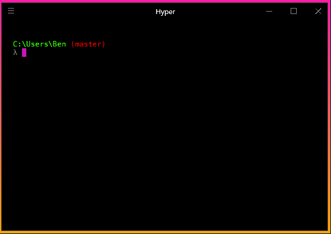

> - 原文地址：[Using Cmder with Hyper](http://blog.bsinky.com/programming/tools/2017/06/11/using-cmder-with-hyper.html)
> - 原文作者：[Benjamin Sinkula](https://github.com/bsinky)
> - 译文出自：[zthxxx's blog](https://blog.zthxxx.me/post/using-cmder-with-hyper/)
> - 译者：[zthxxx](https://github.com/zthxxx)
> - 注：本译文基于 **CC BY-NC-ND 4.0** 发布


今天我们来写写关于 Hyper 的事情，这本质上不过是一个装饰着漂亮 UI 的终端程序。虽然这样说可能留不下什么深刻印象，但它真的看起来很棒！此外，它还有很多插件能让你添加一些无法从标准的终端中获得的特性。

<!--more-->


这在 Windows 上更是如此， 原本终端被限制只能使用 `cmd` 或 `powershell`，虽然后者毫无疑问要更具现代性和可用性，但因为一些原因，我从未发现我自己在 Windows 上使用过 `powershell`，而是只会在当我觉得需要终端时开启 `cmd`。



这让我接触到了 [Cmder](http://cmder.net/)。Cmder 自我描述为一个 「为 Windows 打造的便携式模拟终端」，这貌似与 Hyper 一脉相承。Cmder 有一些挺不错的功能，比如 <kbd>Tab</kbd> 自动补全命令，就我所知[^1]，Windows `cmd` 在很长一段时间里都不支持。它还有许多特性，包括标签页、捆绑了一些好用的功能如 `ls` 和 `grep`，等等。我极度推荐 Cmder 给每个那些频繁在 Windows 下使用终端的人，你不会后悔的！

那么，Cmder 提供了许多很棒的功能，Hyper 看起来又真的很酷……但如果我像在 Hyper 中使用 Cmder 样式的终端呢？

正如我本周早些时候的发现，这确实是可能实现的。

首先，看起来 Cmder 变出许多魔法的关键是通过执行这条命令：

```bat
cmd /k "%ConEmuDir%\..\init.bat"  -new_console:d:%USERPROFILE%
```

让我有点感兴趣的是传入参数中的 `/k` 开关。无论什么 `bat` 文件都能在 Hyper 启动时被轻松调用，因为 Hyper 的 `.hyper.js` 配置文件会暴露终端启动时的启动参数。

考虑到这点，让一个类似 Cmder 的终端运行在 Hyper 中仅仅只需要基于以下几个简单的步骤：

1. 通过**在 Cmder 中**执行 `echo %ConEmuDir%` 命令找出你的 `%ConEmuDir%`  文件夹路径（我不认为这个环境变量会在 Cmder 以外的地方被建立）
2. 在 `.hyper.js` 中，在 `env` 的值下插入一个键 `ConEmuDir: 'Your/ConEmuDir/Path/Here'`
3. 同样是在 `.hyper.js` 中，在 `shellArgs` 数组中添加两个参数值 ——首先是 `/k` 开关，然后是作为第二个值的 `%ConEmuDir%\..\init.bat`

你最终应该得到一些类似于如下的结果[^2]：

```javascript
shellArgs: ['--login', '/k', '%ConEmuDir%\..\init.bat'],
env: {
    'ConEmuDir': 'C:\Path\To\Your\ConEmuDir'
},
```

> 译者注： 这种写法必须限制于路径中没有空格，对于 Cmder 本身安装路径中有空格的情况，有更推荐的写法[^3]。

就是这样！现在你再启动 Hyper，应该就能迎来 Cmder 式的终端体验，拥有彩色的当前工作路径文字，和 Unix 命令支持如 `ls` 等（依赖于你安装了带有这些的 Cmder 版本）。

你可能注意到我省略了 Cmder 中使用的 `-new_console:` 参数，我从来没有尝试过测试它 —— 这个参数可能或不能在 Hyper 正常工作。如果你爱折腾的话，可以自行尝试它。

看到这儿你可能会问我了，「如果 Cmder 在 Windows 下用得挺好的，为什么我还要用 Hyper？」

我认为答案应该是：尝试它们两个！

---

**译者补充：**

Hyper 2.0 及以上版本已经修复了[中文显示的问题](https://github.com/zeit/hyper/issues/2124)，但是截止本篇文章写作时，[Hyper.is](https://hyper.is/) 官网中直接下载到的还是 1.4.8 版本，我是直接在官方 GitHub 仓库的 Releases 中找到并 [Hyper 2.0.4 版](https://github.com/zeit/hyper/releases/tag/2.0.4) 的。

[^1]: 我并不是很确定 `cmd` 什么时候有了 <kbd>Tab</kbd> 自动补全功能，只是到了写这篇文章的时候我尝试启动 `cmd` 后才注意到，当我按下 <kbd>Tab</kbd> 时，某些单词能像 `expl` 到 `explorer` 这样自动补全了。

[^2]: 你的 `.hyper.js` 配置可能本来就没有 `--login` 参数在 `shellArgs` 的值中，我觉得它是默认的参数，所以把它留下来了。我不确定 `--login` 在 `cmd` 和 `powershell` 中代表什么含义……

[^3]:
    直接找到 `init.bat` 的位置，而不再使用相对路径 `%ConEmuDir%\..\init.bat`，

    把整个 `init.bat` 的绝对路径作为一个环境变量，使用单引号包裹双引号的形式，

    再把整个环境变量作为参数传入 `shellArgs`。

    ```javascript
    shellArgs: ['--login', '/k', '%CmderInit%'],
    env: {
      CmderInit: '"C:\\Program Files\\cmder\\vendor\\init.bat"'
    },
    ```
