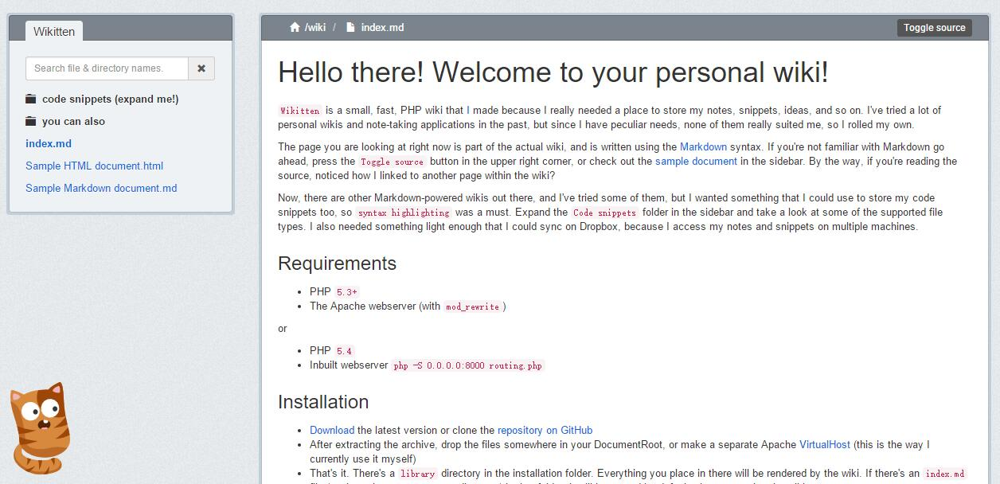
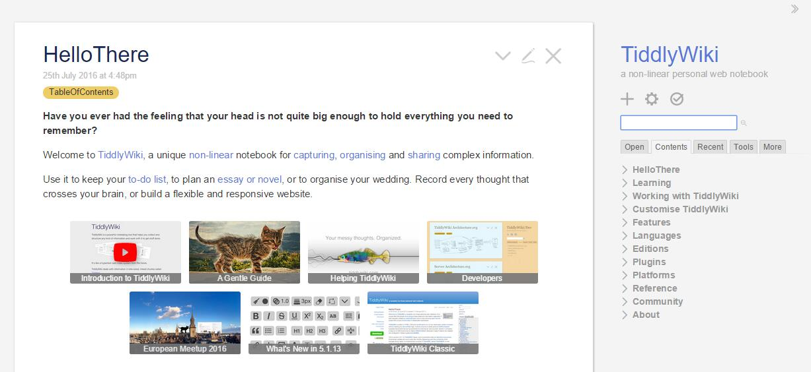
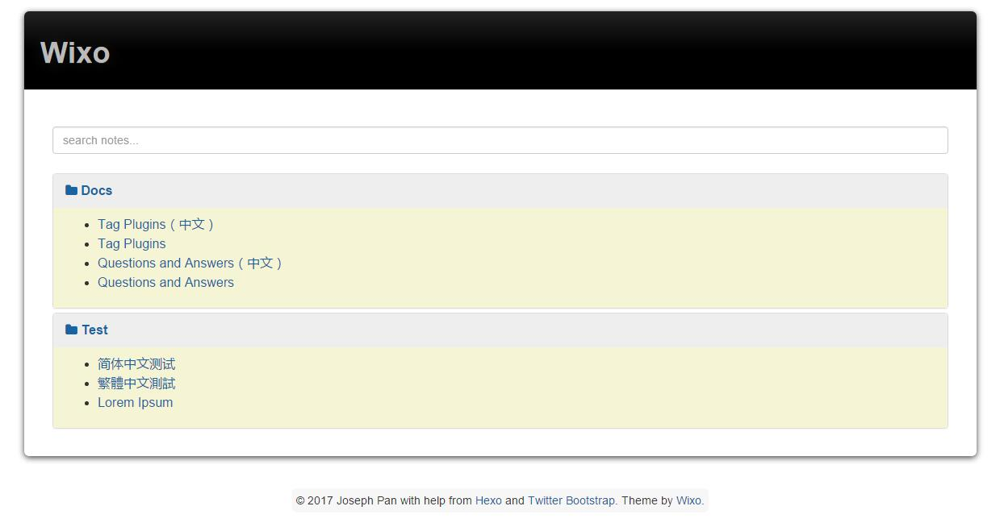
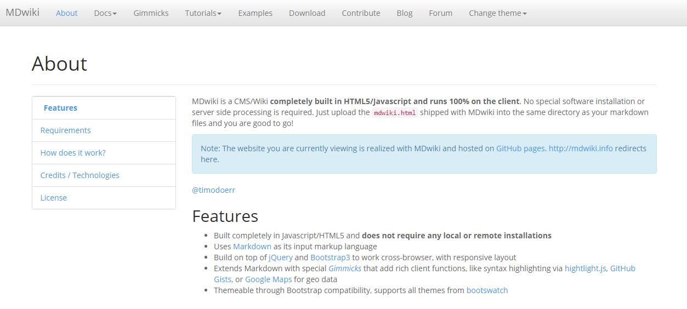

以下多图预警！
TL;DR

## 用 Hexo 做个人 Wiki 知识管理系统

## 起始

**知识是自己构建出来的，不是别人灌输的，也不是看了各种资料背住就完了。**所谓构建，是指接受信息输入之后，通过信息整理加工，消化转变为**自己理解的内容**，并**分类**记录在脑部对应类别的不同层次区域。

就像一个帝国的建立和发展过程，不断的累积资本，转化为力量。通过知识加工这个二次学习的过程，能让我们更加牢固的记住关键知识和产生更加深入的理解。

一直希望寻找一种相对优雅、我比较喜欢的方式来做**知识管理**，帮助知识积累构建；经过尝试了**手写笔记本、OneNote、Evernote、为知笔记**等之后，最终选择用 **个人 Wiki 系统** 来做自己的知识管理。然而天下 Wiki 千千万，选择困难症患者到底该选哪一种呢？

我试了时下好几个流行的、推荐者比较多的 Wiki 系统，但是多少都有些小细节让我不是很满意。在我的 [Wiki 首页](http://wiki.zthxxx.me/wiki/index/) 可以看到我对知识管理和这几个 Wiki 系统的一些简单的看法，以及为此自己开坑了个 Wiki 的[轮子](https://github.com/zthxxx/hexo-theme-Wikitten)。

## 轮子

先放上上我经过了这些使用之后，整理出自己对 **个人 Wiki 系统**的需求：

- 界面简洁，排版整齐，有些留白，不要太满 （要求很宽泛）
- 部署简单，不需要后台与数据库 （最好静态页面）
- 支持多级分类 （**满足知识的分类性**）
- 分类目录可展开和收缩
- 展开分类时可直接看到该分类下所有条目
- 支持全文搜索
- 使用 Markdown 书写
- 适合单人的修改与更新内容
- 最好支持查看历史版本

嗯，所以以上这些也是我自己 Wiki 系统的特性了吧~~

借用 [Hexo](https://hexo.io/)的框架，按 [Wikitten](https://wikitten.vizuina.com/) 的样式，写了个针对于个人 Wiki 的主题 **[hexo-theme-Wikitten](https://github.com/zthxxx/hexo-theme-Wikitten)**。

先放上两个链接：

**我的个人 Wiki 地址：[http://wiki.zthxxx.me/](http://wiki.zthxxx.me/)**

**Wikitten 主题地址：[https://github.com/zthxxx/hexo-theme-Wikitten](https://github.com/zthxxx/hexo-theme-Wikitten)**

再放一个预览的截图：

嘛，样式是跟 [victorstanciu](https://github.com/victorstanciu) 的 [Wikitten](https://wikitten.vizuina.com/) 一样的（人家有 MIT LICENSE 的，并且我提到时也都有注明出处），之所以选择 Wikitten，是因为我觉得这个 Wiki 系统最接近我自己对个人 Wiki 的需求，并且样式也很简洁。不过相比起来，代码就完全不一样了；人家是 PHP，我这是 Hexo 的主题，不需要后台，可以直接挂在 Github Pages 上，省去了服务器；原本只支持搜索标题的，我也给改到支持全文搜索了。

## 浅谈个人 Wiki 系统

个人 Wiki 对我的意义大概就是 **知识的消化、积累、归类整理**，于是我也总结了一套觉得比较合理和适用于自己的简单知识管理流程：

> 1. 通过网页、RSS、微信等网络渠道作为知识获取来源。
> 2. 通过笔记系统（手写笔记、OneNote、Evernote）初步筛选有价值有针对性的信息，**收藏**信息，**分类整理**，做读后**要点**笔记记录。
> 3. 自己平时突然想到或总结的一两句话，或很零碎的点子、灵感，初步消化的内容，则用 **Wiki** 记录。
> 4. 最后当 Wiki 在某版块有一定量后，将这方面笔记和 Wiki 中的内容重读，整理和提炼，二次消化精炼再加上自己的感悟和理解，写成文章发表在 **博客** 上。
>
>
>
> 在使用中，**笔记系统** 主大块信息的**分类和整理**，**Wiki** 主零碎知识的**积累**，而 **博客** 只在于 **精**。
>
> Wiki 中某一版块刚建时，可能只有很少内容或者就一句话，但是通过这种使用流程，日积月累，这方面的事物接触得多了，零散的知识也就多了，那么 Wiki 中这个版块记录的内容也就会变多了，也就是**通过积累，把原本大量碎片化的知识结构化整理起来了**。

关于侧边栏展开这点，我也认同 [@TankyWoo](https://www.v2ex.com/member/TankyWoo)「**一篇维基往往就是一个独立的内容，其次可能和某几篇挂钩，所以左边显示全部标题并不是一个硬需求」**的观点；这的确不是硬性要求，甚至有些不符合维基哲学；但是我用了一些系统后，确实就很强烈的想要有侧边栏、有展开、有跳转的功能；**这也是我认为个人 Wiki 与维基百科的不同地方：**

维百重在知识的**全面**，每个词条的内容全面、详尽，报道不会出偏差，**是信息的堆砌**；词条解释内可能有某些指向其他 wiki 页面的链接，但并不是指这两个词条之间关联，而仅仅是对这个句子中这个词语的解释，参考资料的链接才是挂钩有关联。

个人 Wiki 在这点上，力求对每个词条做到相尽，但做不到全面，受限于个人的知识有限。个人 Wiki 的目的，首先是为了**构建自己的知识体系**，然后才是积累和分享，**知识体系之间是有关联的**，呈网状和层状结构，构建并不是简单的堆砌，而是类似于**分类聚合**的形态，所以分级目录必须有；顶层总体是森林，有不同的树木群，树上有分支，结满果实。

我希望 Wiki 页面能让我随时看到总体分类，把控整体，一是有助于**知识的联想**（看到分类能想得起里面有哪些词条，每条讲的什么，哪些和现在有关），不用点开每条，联想的过程也是在加深印象；二是随时看到知识面的匮乏和自己碌碌无为时激发一定的动力去学习（哎，我确实又懒，还 too young ，有必要学习一个），这点因人而异，不过我觉得好多人也需要吧（不然怎么都是晚上效率暴增。。。唉，都是白天啥也没干的羞耻心）；三是我对 Wiki 使用频率还挺高的，所以比起一般要退回首页才能跳转到其他词条的，有侧边栏链接，真是方便了不少。

## 汇总参考

顺便也汇总说一下我用过一些 Wiki 系统的特点，与其跟我自身需求的差异吧。

【注：以下仅代表个人观点，所述特点因个人关注点而带有严重的片面性，轻喷，希望有不同意见的朋友也来补充一些自己的观点。】

### 00 - **[Wikitten](https://wikitten.vizuina.com/)**

- 双栏
- 界面简洁
- 侧边可展开显示所有条目标题
- 支持 Markdown 书写，支持多种语言
- 支持切换到查看源码
- ***不可全文搜索，只能搜索标题***
- ***需要后台加数据库，部署繁琐***

### 01 - **[TiddlyWiki](http://tiddlywiki.com/)**

- 双栏
- 侧边可展开显示所有条目标题
- 全文可搜索
- 功能丰富
- ***不支持 Markdown，而是 WikiText***
- ***单文件系统***

### 02 - **[MediaWiki](https://www.mediawiki.org/wiki/MediaWiki)**

- 全文可搜索
- 功能丰富，定制程度高
- 重量级，Wiki 系统中最强大
- 支持查看历史版本
- 适合大型项目，多人编辑
- ***不支持 Markdown***
- ***侧边不可展开显示所有条目标题***
- ***界面复杂、臃肿***
- ***需要后台与数据库，部署繁琐***

### 03 - **[Wiko](http://wzpan.github.io/hexo-theme-wixo/)**

- 同为 Hexo 主题
- 全文可搜索
- 界面简洁
- 支持 Markdown 书写
- ***不支持二级分类***
- ***侧边不可展开显示所有条目标题***
- ***搜索也只可以在首页进行搜索***
- ***配色不是很让我喜欢***

### 04 - **[MDwiki](www.mdwiki.net)**

- 界面简洁
- 部署简单
- 支持 Markdown 书写
- ***无搜索功能***
- ***不支持二级分类***
- ***添加分类需手动修改主页顶栏***
- ***不可展开显示所有条目标题***
- ***纯静态，通过 AJAX 显示不同页面***

### 05 - **[VimWiki](http://vimwiki.github.io/)**

- ***无搜索功能*** （感谢指正，有搜索但功能弱并且慢）
- ***不支持 Markdown 语法（但有插件支持）***
- ***不习惯 Vim 的人很难适应***

### 06 - **[DokuWiki](https://www.dokuwiki.org/dokuwiki#)**

- 整体看上去类似 MediaWiki，但没那么强大
- 更适合作为多人编辑的项目文档
- ***虽然没数据库，但依然需要 PHP 做后台***
- ***不支持 Markdown***
- ***配置项目多，大部分教程都说到其配置复杂***
- ***编辑器体验较差***

### 07 - **[Simiki](http://simiki.org/)**

- 单栏
- 界面简洁
- 类似 Wixo
- ***不支持二级分类***
- ***不支持搜索***
- ***侧边不可展开显示所有条目标题***

---

## 后续

嘛，看了这么多，总的来说，**[hexo-theme-Wikitten](https://github.com/zthxxx/hexo-theme-Wikitten)** 的轮子还是很符合我自己的使用习惯；希望在用 Hexo 的朋友，有需要个人 Wiki 系统的，也来试一下下这个主题；后续一堆 Bug 和 TODO List 正在维护，欢迎有兴趣的来提提 Pull request。

