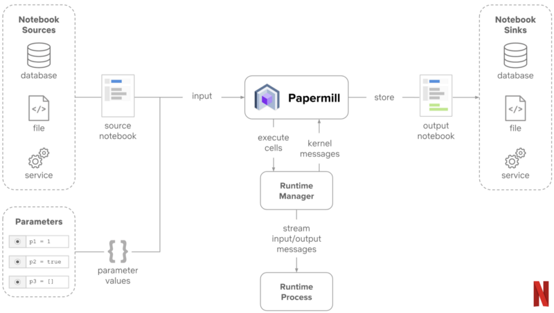
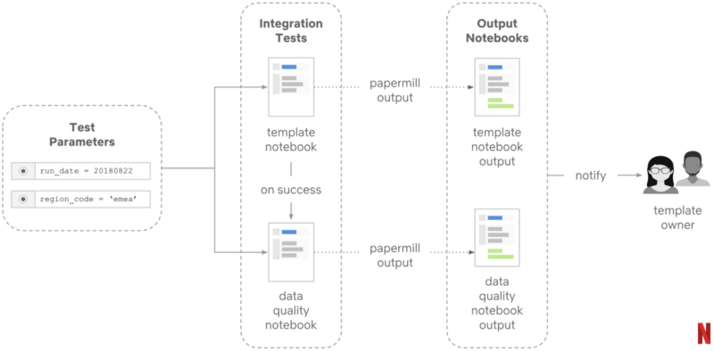

> - 原文地址：[Inside Netflix’s Notebook-Driven Architecture](https://blog.goodaudience.com/inside-netflixs-notebook-driven-architecture-aedded32145e)
> - 原文作者：[Denny Headrick](https://twitter.com/jrdothoughts)
> - 译文出自：[zthxxx's blog](https://blog.zthxxx.me/post/inside-netflix-notebook-driven-architecture/)
> - 译者：[zthxxx](https://github.com/zthxxx)

Jupyter Notebook 是数据科学家库中最强大的工具之一。通常，诸如 Jupyter 或 Zeppelin 等 Notebook 技术用于各种任务，例如数据挖掘，模型测试或数据准备。

如果你在一个小型的数据科学家团队，那么使用 Notebook 场景似乎非常有限，但是大型组织运行几十个并行的数据科学工作又如何呢？

最近，Netflix 工程团队发布了一系列博客文章，详细的介绍了他们使用  Jupyter Notebook 应用的内部架构。

## Netflix 中的 Notebooks

最初，Netflix 采用 Jupyter Notebook 作为数据挖掘和分析的工具。

然而，工程团队很快意识到 Jupyter 在运行时的抽象、可扩展性、代码的可解释性和调试方面提供了明显的优势，如果使用得当，这些优势可能会对数据科学工作效率产生重大影响。

为了扩大 Jupyter 作为数据科学分析的使用，Netflix 工程团队需要解决几个主要挑战：

- **代码-输出不匹配**：Notebooks 经常被修改，很多时候，你在环境中看到的输出与当前代码不对应。

- **服务器要求**：Notebooks 通常需要运行 Notebook 服务器运行时 (Jupyter)，这在大规模采用时是一个架构挑战。

- **调度**：大多数数据科学模型需要定期执行，但是用于调度 Notebook 的工具仍然相当有限。

- **参数化**：Notebooks 是相当静态的代码环境，但输入参数的使用场景又非常繁多。

- **集成测试**：每个 Notebook 是独立的代码环境，很明显这很难与其他 Notebooks 集成。因此，使用 Notebooks 时，像集成测试这样的任务就是个噩梦。

为了应对上述一些挑战，Netflix工程团队开始努力为 Jupyter 封装一系列基础架构，以图简化 Notebook 在整个团队中应用的困难。

## Runtime 运行时

要解决的第一个挑战是创建一个与服务器无关的运行时，支持 Notebook 的参数化执行。

Netflix 决定采用 [Papermill](https://github.com/nteract/papermill) 来实现这一目标。[Papermill](https://github.com/nteract/papermill) 基于流行的 [nteract](https://nteract.io/) 库，是一个用于参数化、执行和分析 Jupyter Notebook 的工具。

从技术上讲，[Papermill](https://github.com/nteract/papermill) 接收  Notebook  路径和一些参数输入，然后使用输入执行和渲染请求的 Notebook。当每个单元被执行时，它将产生的结果保存到一个独立输出的 Notebook 中。

[Papermill](https://github.com/nteract/papermill) 的另一个好处是能够将 Notebook 的输出存储在不同的存储格式中。

以 Netflix 为例在，团队决定将任何 Notebook 执行的结果输出到由 [Commuter](https://github.com/nteract/nteract/tree/master/applications/commuter) 管理的 S3 bucket 中；

[Commuter](https://github.com/nteract/nteract/tree/master/applications/commuter) 是另一个基于 [nteract](https://nteract.io/) 的平台，包括用于查找 Notebook 的资源浏览器，并提供了兼容 Jupyter 版本的内容 API。

从高层次来看，Netflix 笔记本架构开始看起来如下图所示：

## 调度

Netflix 工程团队需要解决的另一个关键挑战是创建基础架构，以便能够定期执行 Notebook。

在引入 Papermill 之后，这一挑战变得相对容易解决，因为这个架构本质上将参数化执行与调度分离，这意味着它可以与不同的调度器模型配合使用。

Netflix 团队决定将他们的 Notebooks 与他们自己的调度框架 [Meson](https://medium.com/netflix-techblog/meson-workflow-orchestration-for-netflix-recommendations-fc932625c1d9) 集成。从技术上讲，[Meson](https://medium.com/netflix-techblog/meson-workflow-orchestration-for-netflix-recommendations-fc932625c1d9) 是一个通用的工作流程编排和调度框架，用于跨异步系统执行 ML 管道。

这一过程的架构相对简单，如下图所示：

## 集成测试

为了在 Noteboo k架构中自动化集成测试，Netflix 采用了 [Papermill](https://github.com/nteract/papermill) 的多输出功能。本质上，集成测试是另一个Notebook，输出成为目标 Notebook 的输入。

Netflix 的架构是我见过的大规模使用 Jupyter Notebook 最先进的基础设施之一。在这种架构中实现的大多数模式都基于开源工具，并且可以被刚开始进行数据科学之旅的团队轻松使用。

